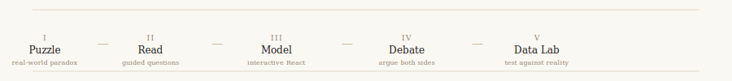
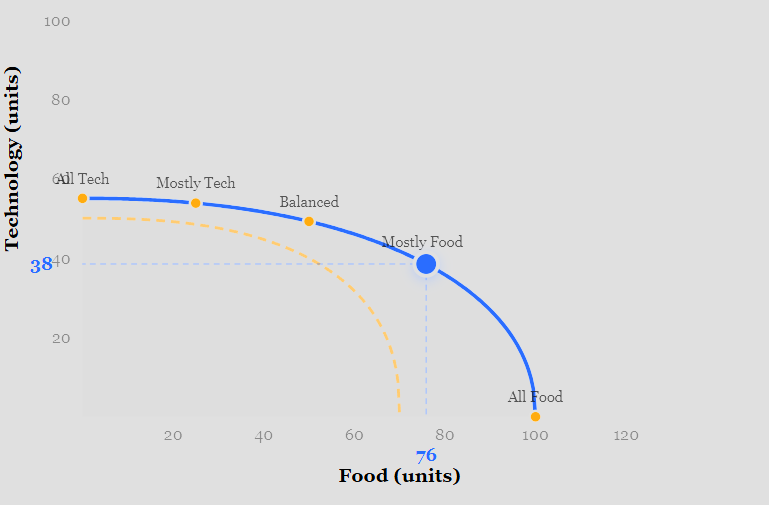
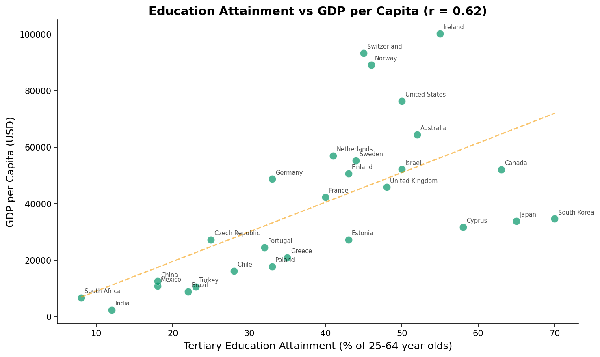
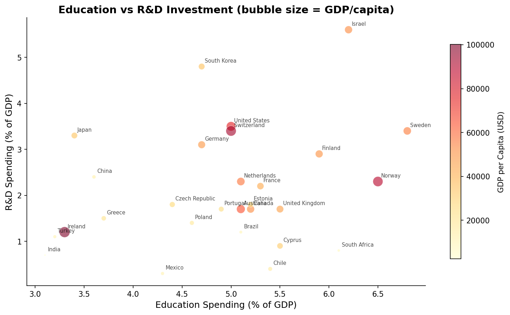

# Microeconomics, the Way It Should Be Taught

> "Free" university costs EUR 21,200 per year. Instagram costs 182 hours of your life annually. Every government budget is a production possibilities frontier someone chose a point on. — *Chapter 1*

This repo is an experiment in learning economics the way the best programs in the world do it — not through memorization, but through **puzzles, models, debate, and data**.

<p align="center">
  
</p>

Each chapter of Case, Fair & Oster's *Principles of Microeconomics* becomes a 5-phase study module:

**1. The Puzzle** — A real-world fact that doesn't make sense yet. Real data, real markets, real countries. *"Why did hand sanitizer prices spike 400% instantly while lumber took 4 months?"*

**2. Read** — Guided reading with questions drawn from MIT 14.01, Harvard Ec 10, and Yale Open Courses. Not just "what does the model say?" but "what assumption would need to change for the model to break?"

**3. The Model** — Interactive React visualizations. Drag supply and demand curves. Watch equilibrium shift. Feel opportunity costs increase as you move along a production possibilities frontier.

**4. Debate** — A real policy question with no right answer. You argue *both sides* using the same model. This is where understanding separates from memorization — if you can't argue against your own position, you don't understand the model well enough.

**5. Data Lab** — Python scripts that test the chapter's model against actual economic data from OECD, FRED, and World Bank. The model predicts X. Does reality agree? Where does it break? *This is the phase most students skip. It's the most important one.*

---

## Chapter 1: Thinking Like an Economist

### The Puzzle
Asks: *"Your friend says the scholarship university is free. What does it actually cost?"* — then reveals EUR 21,200/year in real costs, with foregone earnings as the biggest line item.

### The Model
An interactive PPF explorer with draggable production point and 5 real-world scenario presets:

<p align="center">
  
</p>

> *Drag the blue point along the frontier. Watch marginal opportunity cost rise as you produce more food — the best tech workers are being pulled into farming. Switch to "COVID-19 Pandemic" and watch the frontier contract. Switch to "After Investment" and watch it expand. That's economic growth.*

### The Data Lab
Tests the PPF model against real OECD data for 28 countries:

<p align="center">
  
</p>

Education *attainment* correlates with GDP per capita — but education *spending* barely does. It's not how much you invest, but what you get for it.

<p align="center">
  
</p>

The richest countries invest heavily in *both* education and R&D. Cyprus spends 5.5% of GDP on education but only 0.9% on R&D — lowest among its peers.

### The Debate
*"Should Cyprus make university education free?"* — argue FOR using opportunity cost (foregone human capital), then argue AGAINST using the same framework (foregone healthcare, infrastructure). No right answer. Just rigorous thinking.

---

## All Chapters

| | Module | Core Model | Highlights |
|---|---|---|---|
| **Ch 1** | [Thinking Like an Economist](ch1-thinking-like-an-economist/) | Opportunity cost, PPF | Interactive PPF · OECD data lab · Policy debate |
| **Ch 3** | Supply and Demand | Equilibrium, shifts | *Coming next* |
| **Ch 5** | Elasticity | Price elasticity | — |
| **Ch 6-7** | Consumer Behavior | Utility maximization | — |
| **Ch 8-9** | Costs & Competition | Profit maximization | — |
| **Ch 12** | Monopoly | Market power, DWL | — |
| **Ch 14** | Externalities | Market failure | — |

## Running It

```bash
cd ch1-thinking-like-an-economist
pip install pandas matplotlib numpy

python puzzle.py          # Phase 1: before reading
# Read Chapter 1 with reading_guide.md
# Open model.jsx in Claude for interactive PPF
# Complete debate.md — argue both sides
python data_lab.py        # Phase 5: after reading
```

## Why This Exists

Most economics courses teach models as facts. The best ones teach models as *lenses* — useful simplifications that reveal some truths and hide others. This repo tries to replicate that second kind of education: every chapter ends with you confronting the model's predictions against messy, real-world data, and deciding for yourself what it gets right and what it misses.

## Part of a Larger System

| Repo | Domain | Method |
|---|---|---|
| **This repo** | Economics | Puzzle → Read → Model → Debate → Data |
| [stallings-security](https://github.com/NikolasNeofytou/stallings-security) | Computer Security | Feel the attack → Read → Build the defense |
| [clrs-algorithms](https://github.com/NikolasNeofytou/clrs-algorithms) | Algorithms | Feel the slowness → Read → Build and benchmark |
